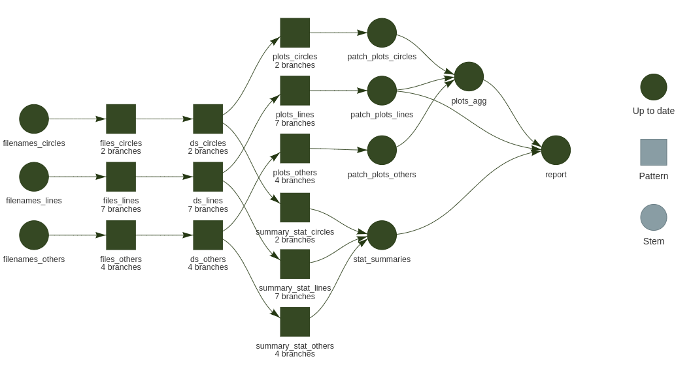

# Targets demos

## A workflow manager

[**Targets**](https://github.com/ropensci/targets) is an **R** package that is

>Function-oriented Make-like declarative workflows for R 

Main author: [William Landau](https://wlandau.github.io/about.html).
See the `targets` [manual](https://books.ropensci.org/targets/literate-programming.html) for an extensive documentation.

The goal is to create so-called `targets` that are significant steps that linked between one another.
Those links create the dependencies, and once one `target` run successfully and its upstream dependencies are up-to-date,
they are no reason to run it again. Time/Computing intensive steps are then cached in the `store`.

Invalidation of a `target` arises when:

- Upstream targets invalidate (or input files _checksum_ for special `format = "file"`)
- Code of the targets changed
- Package used was updated

## Example dataset: datasauRus {height=100}

The great package [`datasauRus`](https://jumpingrivers.github.io/datasauRus/) offers a fake table which
 consists of 13 dataset (each of 142 observations) with 2 values `x` and `y`:
 
```
# A tibble: 1,846 × 3
   dataset     x     y
   <chr>   <dbl> <dbl>
 1 dino     55.4  97.2
 2 dino     51.5  96.0
 3 dino     46.2  94.5
 4 dino     42.8  91.4
 5 dino     40.8  88.3
 6 dino     38.7  84.9
 7 dino     35.6  79.9
 8 dino     33.1  77.6
 9 dino     29.0  74.5
10 dino     26.2  71.4
# … with 1,836 more rows
```

For each the 3 demos, we use different versions of the same data:

- One tabulated-separated-value (tsv) file of 1847 lines (1846 observations + 1 header)
- One folder that contains 13 tsv of 143 lines 
- Three folders of 2, 4 and 7 tsv of 143 lines each


## Multiple projects in one folder

This is supported by `targets` and described in the [manual: projects](https://books.ropensci.org/targets/projects.html).
A config YAML file, `_targets.yaml` describe the 3 different projects, specifying the name of both:

- the `targets` R script (actual definition of `target`)
- the store folder name (where objects are cached and described)

Additional options or inheritance can be specified too. 

Content:

``` yaml
ds_linear:
  store: _ds_1
  script: _targets_ds_1.R
ds_dynamic:
  store: _ds_2
  script: _targets_ds_2.R
ds_static:
  store: _ds_3
  script: _targets_ds_3.R
  reporter_make: verbose_positives # do not display skipped targets
```

## Packages needed

Those demos are using several packages, you can get the necessary ones by using [`renv`](https://rstudio.github.io/renv/articles/renv.html). Once the repo cloned/downloaded:

``` r
renv::restore()
```

to install a local library of the key packages.

## One file, linear pipeline

Using the original `tsv` from the package `datasauRus` itself. `targets` allows to track the timestamp of an URL.

Here we track `https://raw.githubusercontent.com/jumpingrivers/datasauRus/main/inst/extdata/DatasaurusDozen-Long.tsv`.

See the complete `targets` R script in `_targets_ds_1.R` and displayed dependencies as [directed acyclic graph](https://en.wikipedia.org/wiki/Directed_acyclic_graph):


`targets` encourages using [literate programing](https://books.ropensci.org/targets/literate-programming.html) where 
a **Rmarkdown** document higher level comments and code, dependencies are based on the parsing of the `tar_read()` and `tar_load()` calls within it. This can be used as smart caching system where help focusing on the analysis report, leaving the computation 
for the R script `_targets.R`. 

For this first example, the corresponding `Rmd` is `ds1.Rmd`. It will be rendered by the pipeline (target definition in `tar_render()`).

To run this example:

``` r
# Specify which projet to use
Sys.setenv(TAR_PROJECT = "ds_linear")
# Run what is needed like make in a Makefile
targets::tar_make()
```

For the first run, `tar_make()1 should output something like:

```
> targets::tar_make()
• start target ds_file
• built target ds_file [0.695 seconds]
• start target ds
• built target ds [0.176 seconds]
• start target anim
• built target anim [48.762 seconds]
• start target all_facets
• built target all_facets [0.007 seconds]
• start target gif
• built target gif [0.005 seconds]
• start target report
• built target report [4.144 seconds]
• end pipeline [54.083 seconds]
```

The GIF animation takes roughly one minute, so it would be cumbersome to wait this time at each Rmarkdown knitting process.
It is a good case for `targets`, the GIF will be re-run only if needed while you polish the Rmd report.

See the output of re-reruning `tar_make()` again:

```
> targets::tar_make()
✔ skip target ds_file
✔ skip target ds
✔ skip target anim
✔ skip target all_facets
✔ skip target gif
✔ skip target report
✔ skip pipeline [0.27 seconds]
```

0.27 seconds versus 54.


## One folder, dynamic branching

Often, input files are more than one. Of course, you don't want to list them by hand 
and one want to apply similar treatment to each of them. Moving away from **for loops**, 
we embrace functional programming and let `targets` branching over the list of files and
 dynamically for it adapts to how many are present.
 
This is called [dynamic branching](https://books.ropensci.org/targets/dynamic.html) and it contains the _magic_ aggregation (like `bind_rows()`) when calling the target **name**.

On the filesystem, the folder `data` contains 13 files:

```
data/
├── dset_10.tsv
├── dset_11.tsv
├── dset_12.tsv
├── dset_13.tsv
├── dset_1.tsv
├── dset_2.tsv
├── dset_3.tsv
├── dset_4.tsv
├── dset_5.tsv
├── dset_6.tsv
├── dset_7.tsv
├── dset_8.tsv
└── dset_9.tsv
```

Which once tracked by `targets` are:

``` r
> tar_read(dset) |> 
    enframe()
# A tibble: 13 × 2
   name          value           
   <chr>         <chr>           
 1 dset_e814d3a7 data/dset_1.tsv 
 2 dset_96886f69 data/dset_10.tsv
 3 dset_a4c9d9df data/dset_11.tsv
 4 dset_02e8e253 data/dset_12.tsv
 5 dset_39f18392 data/dset_13.tsv
 6 dset_d74af7a4 data/dset_2.tsv 
 7 dset_55280675 data/dset_3.tsv 
 8 dset_80822375 data/dset_4.tsv 
 9 dset_020f0640 data/dset_5.tsv 
10 dset_0577d04d data/dset_6.tsv 
11 dset_66982b15 data/dset_7.tsv 
12 dset_3c9c9095 data/dset_8.tsv 
13 dset_fe11a7b7 data/dset_9.tsv 
```


Finally, the DAG is:


You see that all targets appears in blue, so outdated. This is the expected behavior of [`tar_files()`](https://docs.ropensci.org/tarchetypes/reference/tar_files.html). We don't know 
in advance how many (if any) files are present, so the listing is checked all the time and downstream targets are then also outdated.

However, the downstream targets are re-run only if needed

- If input files _changed_
- If code for those targets _changed_.

See example of re-running `tar_make()`. `dset_files` was run again, but no files were different 
so all the rest is **skipped** and the whole pipeline took 1.1 second.

```
> targets::tar_make()
• start target dset_files
• built target dset_files [0.702 seconds]
✔ skip branch dset_6630d1f3
✔ skip branch dset_f10c2c43
✔ skip branch dset_c79e8ff6
✔ skip branch dset_b1eac8ed
[...]
✔ skip branch plots_01ca2c35
✔ skip branch plots_9fc19e45
✔ skip branch plots_01f427e3
✔ skip pattern plots
✔ skip target report
• end pipeline [1.172 seconds]
```

Dynamic branching scales great on the DAG since the number of branches can be reported, no additional items are created. 
to avoid this, we can switch to  [`tar_files_input()`](https://docs.ropensci.org/tarchetypes/reference/tar_files_input.html) which 
also _automatically groups input files into batches to reduce overhead and increase the efficiency of parallel processing._.

See the DAG with `tar_files_input()`:


## Several folders, dynamic within static branching

We created a folder structure as we often have to deal with, 3 sub-folders of data:

```
circles
├── dset_2.tsv
└── dset_3.tsv
lines
├── dset_11.tsv
├── dset_12.tsv
├── dset_13.tsv
├── dset_6.tsv
├── dset_7.tsv
├── dset_8.tsv
└── dset_9.tsv
others
├── dset_10.tsv
├── dset_1.tsv
├── dset_4.tsv
└── dset_5.tsv
```

Especially with **static** branching, it is meaningful to check which commands are planned.
See the **manifest** for this example:

```
> tar_manifest() |> print(n = Inf)
# A tibble: 21 × 3
   name                 command                                                                                                   pattern
   <chr>                <chr>                                                                                                     <chr>  
 1 filenames_circles    "fs::dir_ls(\"circles\", glob = \"*tsv\")"                                                                NA     
 2 filenames_others     "fs::dir_ls(\"others\", glob = \"*tsv\")"                                                                 NA     
 3 filenames_lines      "fs::dir_ls(\"lines\", glob = \"*tsv\")"                                                                  NA     
 4 files_circles        "filenames_circles"                                                                                       map(fi…
 5 files_others         "filenames_others"                                                                                        map(fi…
 6 files_lines          "filenames_lines"                                                                                         map(fi…
 7 ds_circles           "read_tsv(files_circles, show_col_types = FALSE)"                                                         map(fi…
 8 ds_others            "read_tsv(files_others, show_col_types = FALSE)"                                                          map(fi…
 9 ds_lines             "read_tsv(files_lines, show_col_types = FALSE)"                                                           map(fi…
10 summary_stat_circles "summarise(ds_circles, m_x = mean(x), m_y = mean(y))"                                                     map(ds…
11 plots_circles        "ggplot(ds_circles, aes(x, y)) + geom_point()"                                                            map(ds…
12 summary_stat_others  "summarise(ds_others, m_x = mean(x), m_y = mean(y))"                                                      map(ds…
13 plots_others         "ggplot(ds_others, aes(x, y)) + geom_point()"                                                             map(ds…
14 plots_lines          "ggplot(ds_lines, aes(x, y)) + geom_point()"                                                              map(ds…
15 summary_stat_lines   "summarise(ds_lines, m_x = mean(x), m_y = mean(y))"                                                       map(ds…
16 patch_plots_circles  "wrap_plots(plots_circles) + plot_annotation(title = stringr::str_split_i(tar_name(), \n     \"_\", -1))" NA     
17 patch_plots_others   "wrap_plots(plots_others) + plot_annotation(title = stringr::str_split_i(tar_name(), \n     \"_\", -1))"  NA     
18 patch_plots_lines    "wrap_plots(plots_lines) + plot_annotation(title = stringr::str_split_i(tar_name(), \n     \"_\", -1))"   NA     
19 stat_summaries       "dplyr::bind_rows(summary_stat_lines = summary_stat_lines, \n     summary_stat_circles = summary_stat_ci… NA     
20 plots_agg            "wrap_plots(list(patch_plots_lines = patch_plots_lines, \n     patch_plots_circles = patch_plots_circles… NA     
21 report               "tarchetypes::tar_render_run(path = \"ds3.Rmd\", args = list(input = \"ds3.Rmd\", \n     knit_root_dir =… NA    
```

You see that we get meaningful names based on the 3 folders listed. Still we get dynamic branching for reading 
files inside each folder. The same treatment is performed on each 3 input folders but 
when we want/need to combine the parallel branches for a relevant aggregation, we use `tar_combine()`.
Example of both aggregating tibbles or plots are exemplified as depicted below:


